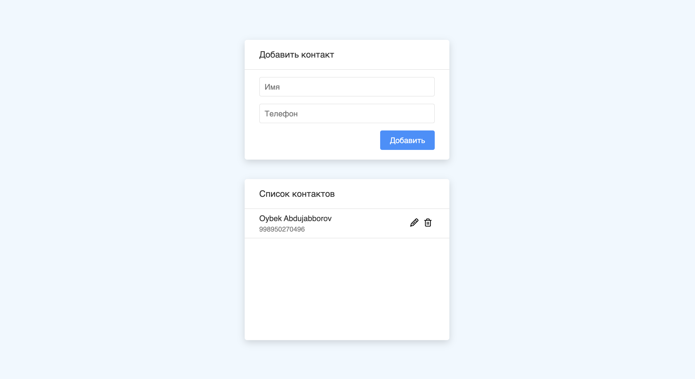

# Contact App (CRUD)

### Insonning aqliy va jismoniy faoliyati mahsuli, jumladan, ijod namunalari, ixtiro va kashfiyotlari, turli ishlanmalari — uning shaxsiy, daxlsiz intellektual mulki xisoblanadi. Shuning uchun undan mulk egasining ruxsatisiz foydalanishga hech kim haqli emas. Bu hamma joyda, jumladan, yurtimizda ham qonun bilan himoya qilinadi.

[Instagram](https://www.instagram.com/oybekabduljabbor/)

